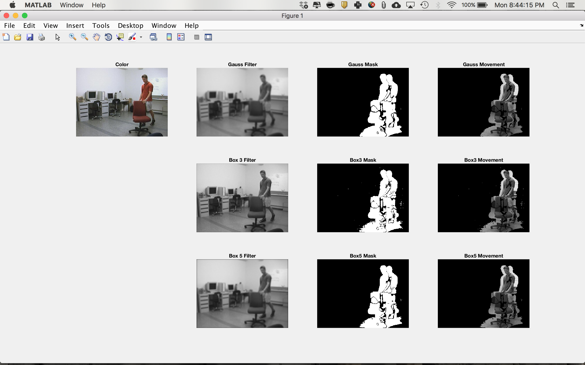
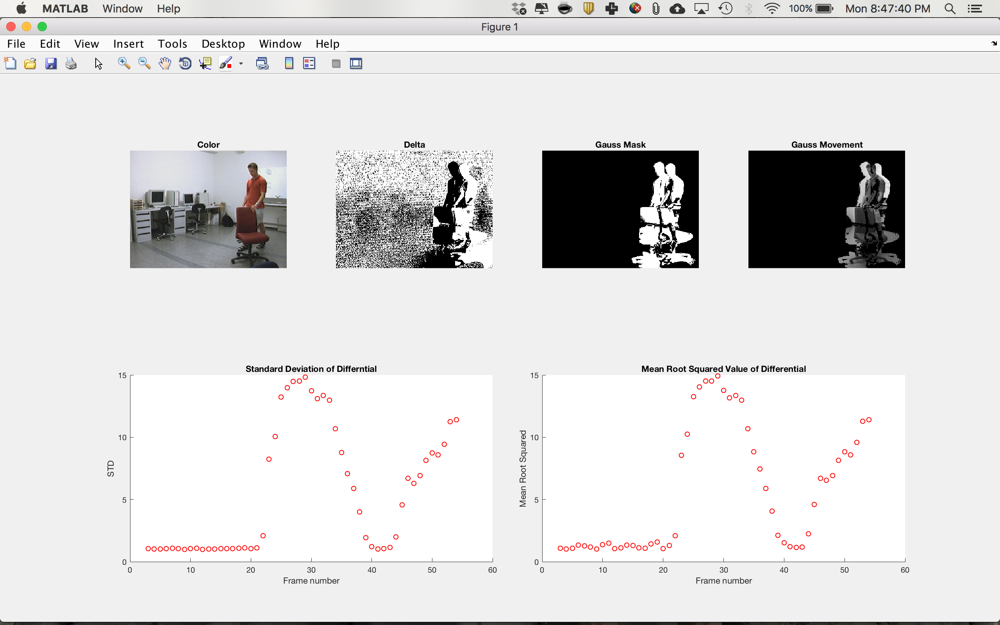
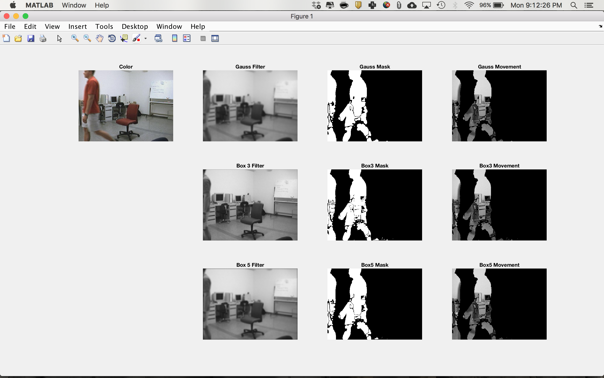

# Project 1: Motion Detection

## Introduction
This project explored motion detection and several factors that affect the
efficacy of motion detection in video. We compared gaussian and temporal
differential filters for taking the differences between frames, as well as the
effect of spatial filters (3x3 Box, 5x5 Box, Gaussian) on performance. Further,
we evaluated the standard deviation within the frame derivates to find the best
values to use as for cutoff.

## Algorithms
There were three main components to our processing pipeline: Spatial Filtering,
Temporal Filtering, and Thresholding.

### Spatial Filters
  We compared three spatial filters: 3x3 Box, 5x5 Box, and Gaussian. The purpose of
  the spatial filters were to blur frames, smoothing out high frequency noise. As
  the images grew more blurry, chunks of movement were better captured and as a
  result, larger groupings of movement were captured (as opposed to smaller
  disjoint chunks).

  

  In the comparison of filters, we see that as the amount of blur INCREASES, the
  size of chunks grows larger and boundaries have smoother edges. This is a result
  of the high frequency noise being filtered out. Box3 which only uses a 3x3
  window around each pixel is less blurry than Box5. Looking at the mask produced
  by Box3 shows that the edges are sharper and that the filtered chunks are larger.

  This comparison shows that when trying to capture motion, a the larger the blur
  present in images, the larger and clearer chunks of motion are captured.

### Temporal Filters
  We used two different temporal filters to calculate the derivatives between
  image frames. The first filter was a basic differential operator. The derivative
  of frame `k` was found by taking the values of frame `k+1` and subtracting out
  the values of frame `k-1`. The result was an image representing the difference
  between the two frames.

  We compared this to an implementation that convolved the differential
  matrix by a 1D gaussian filter.

  

  In this figure, we plotted the result of the the motion tracking pipeline with
  a Gaussian differential filter without spatial smoothing. The lack of spatial
  smoothing can be seen in the noise shown in the center of the frame.

### Thresholding
  As shown in the figure above, there is a significant amount of noise left in the
  derivative image. In order to capture the differential, a threshold value must
  be set to filter out small differences from frame to frame that do
  not represent the regions of interest.

  This was done by plotting the standard deviation of each differential frame
  over time. By watching the video, we could roughly determine the intensity of
  the noise over time. The threshold (with some experimentation) was then set to
  5X the standard deviation in times of no motion. The threshold value was set to
  `10`.

## Observations and Conclusions
  One of the key limitations of the way we currently find the region of interest
  is the mask captures the location of the moving component in the previous and
  next frame, but does not capture the moving object of the current frame. When
  the moving component moves quickly enough, the two bounding regions separate
  and leave hole where the object (person) actually is. This is because the pixels
  that are different between the two frames will mark the area the object
  started and ended in each frame. As such, the differentials can be used as
  bounding edges of the window rather than specific windows highlighting motion.

  

  Another weakness of the current algorithm is that the threshold value used to
  determine movement is fixed. This means that large changes in light will cause
  the whole scene to render as motion since all pixels will have changed in value.
  This can be seen in the change in light during the RedChair video.

  

  This can be remedied by updating the threshold periodically to determine whether
  changes in values are outside the norm of all other changes in value for the
  particular frame, rather than compared to an absolute value. 
