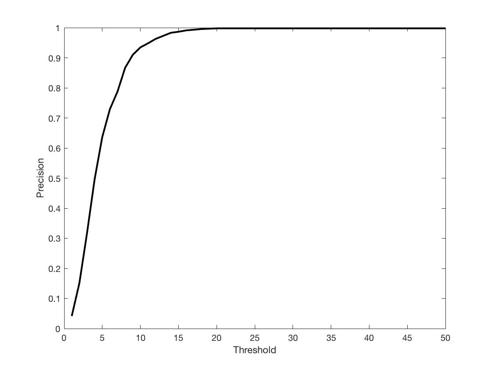
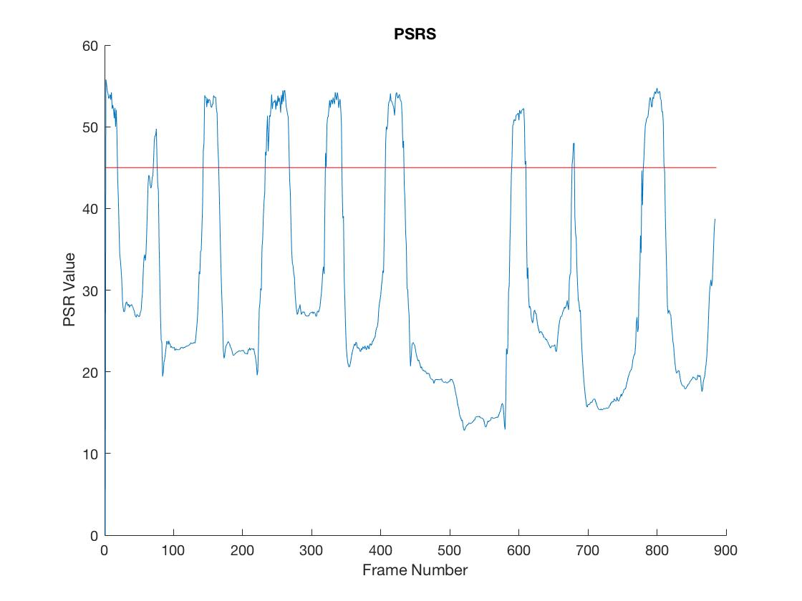

# Project 4: Occlusion Detection with the Circulant Matrix tracker

## Abstract
In this project, we adapted the circulant matrix tracker (CMT) to detect occlusion
during tracking. We further attempted to predict the motion of the object over
time to assist in recovery from occlusion.

# Occlusion Detection
The model of the CMT gradually changes over time to account for changes
in the appearance of the tracked object. This makes it especially important to
detect when occlusions occur to prevent the tracker from "learning" on the occluding
object.

In this figure, we can see as the book crosses in front of the persons face,
noise is introduced to the response values across image. As the book settles for
a couple frames, the noise gradually dies down as the CMT "learns" what the book
looks like.

The CMT uses a peak response filter to predict the likelihood that the given target
exists in a window in an image. Finding the pixel with the maximum response value
indicates the best match the tracker.

By taking the peak to side-lobe ratio (PSR), we estimate how certain the tracker
is a particular point represents the center of the tracked object. Low ratios
indicate the tracker is less certain of the outcome with weight being spread
across a number of possible pixels. This uncertainty could also represent an
occlusion. By thresholding the PSR value, we could estimate when the tracked
target was occluded.

In this figure, we interpret any frame with a PSR < 45 to be an occlusion. We can
see that whenever the book crosses over the woman's face, an occlusion is detected.
When the occlusion is detected, the tracker does not update its model, thus
preventing the tracker from learning (and in the future, tracking) the book.
The response graph shows that the model does not update with the appearance of
the book because the noise introduced by the appearance of the book does not fade
away like the previous example. 

## Experiments

## Conclusion

